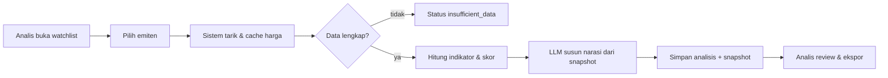

# BRD — AI Agent Analisis Saham

| | |
|---|---|
| **Dokumen** | Business Requirements Document |
| **Versi** | 1.0 |
| **Tanggal** | 26 Agustus 2026 |
| **Status** | Draft untuk persetujuan sponsor |
| **Cakupan** | v1 — saham IDX, 1 pengguna organisasi, analisis harian |

---

## 1. Latar Belakang

Investor ritel dan analis junior menghabiskan waktu berjam-jam setiap hari untuk pekerjaan yang sebenarnya berulang: menarik harga, menghitung indikator, membaca laporan keuangan, lalu menyusunnya jadi satu kesimpulan. Pekerjaan itu lambat, tidak konsisten antar orang, dan jejaknya hilang begitu file Excel ditutup.

Di sisi lain, LLM sekarang cukup baik untuk **menarasikan** analisis, tetapi buruk untuk **menghitung**. Kombinasi yang benar adalah: angka dari kode, narasi dari model.

## 2. Pernyataan Masalah

| # | Masalah | Dampak bisnis |
|---|---|---|
| B-1 | Analisis manual memakan 2–4 jam/hari per analis | Biaya tenaga tinggi, cakupan emiten sempit |
| B-2 | Hasil analisis tidak konsisten antar analis dan antar hari | Keputusan sulit dibandingkan, tidak ada baseline |
| B-3 | Tidak ada jejak audit: kenapa dulu kita simpulkan begitu? | Tidak bisa belajar dari kesalahan, risiko kepatuhan |
| B-4 | Data pasar tersebar di banyak sumber, sering tidak lengkap | Kesimpulan diambil di atas data bolong tanpa disadari |
| B-5 | Output LLM mentah sering mengarang angka | Risiko reputasi dan kerugian finansial |

## 3. Tujuan Bisnis

| # | Tujuan | Ukuran keberhasilan |
|---|---|---|
| G-1 | Memangkas waktu analisis per emiten | dari ±30 menit menjadi < 2 menit |
| G-2 | Menaikkan cakupan pemantauan | dari ±10 emiten menjadi ≥ 100 emiten watchlist |
| G-3 | Menjamin setiap kesimpulan bisa ditelusuri | 100% analisis punya `data_snapshot` tersimpan |
| G-4 | Menekan halusinasi angka | 0 angka dalam narasi yang tidak ada di snapshot (diuji sampling mingguan) |
| G-5 | Reprodusibilitas | analisis 90 hari lalu bisa direproduksi identik |

## 4. Ruang Lingkup

### 4.1 Termasuk (v1)
- Saham yang tercatat di Bursa Efek Indonesia.
- Data harga harian (OHLCV) dan rasio fundamental dasar.
- Indikator teknikal: MA, EMA, RSI, MACD, Bollinger, volume relatif.
- Skoring komposit teknikal + fundamental dengan bobot yang bisa dikonfigurasi.
- Narasi berbahasa Indonesia dari LLM di atas angka yang sudah dihitung.
- Watchlist, riwayat analisis, ekspor CSV/PDF.
- Antarmuka web HTML sederhana.

### 4.2 Tidak termasuk (v1)
- Eksekusi order / integrasi broker.
- Data intraday realtime dan tick data.
- Saham luar negeri, kripto, derivatif.
- Backtesting strategi otomatis (dipertimbangkan v2).
- Rekomendasi investasi berlisensi (produk ini decision support).
- Aplikasi mobile native.

## 5. Pemangku Kepentingan

| Peran | Kepentingan utama |
|---|---|
| Sponsor / pemilik produk | ROI, waktu ke pasar, biaya API LLM terkendali |
| Analis (pengguna utama) | Kecepatan, akurasi, kemudahan verifikasi |
| Admin sistem | Ketersediaan data, biaya, keamanan kunci API |
| Compliance / legal | Disclaimer, jejak audit, tidak memberi nasihat investasi |
| Pengembang | Kejelasan spesifikasi, stack minimal |

## 6. Proses Bisnis Sasaran

## 7. Aturan Bisnis

| # | Aturan |
|---|---|
| BR-1 | Sistem tidak pernah menyatakan "beli" atau "jual" sebagai instruksi; hanya skor, alasan, dan tingkat keyakinan. |
| BR-2 | Setiap output wajib memuat disclaimer risiko dan tanggal data. |
| BR-3 | Analisis yang tersimpan bersifat immutable; koreksi berupa revisi baru. |
| BR-4 | Data yang lebih tua dari batas kesegaran wajib ditandai basi, bukan dipakai diam-diam. |
| BR-5 | Kunci API dan data pengguna tidak boleh keluar ke pihak ketiga selain penyedia yang disetujui. |
| BR-6 | Biaya LLM per analisis dibatasi; melebihi kuota harian = antre, bukan tagihan membengkak. |

## 8. Manfaat & Justifikasi

- **Efisiensi**: G-1 dan G-2 setara menghemat ±1,5 FTE analis junior.
- **Kualitas keputusan**: metodologi seragam dan terdokumentasi.
- **Kepatuhan**: jejak audit lengkap menurunkan risiko sengketa.
- **Biaya rendah**: stack stdlib-first, satu file database, tanpa infrastruktur berat.

## 9. Risiko & Mitigasi

| Risiko | Dampak | Mitigasi |
|---|---|---|
| Penyedia data mengubah/menutup API | Tinggi | Adapter tunggal terisolasi di `agent/data.py`, cache lokal |
| LLM mengarang angka | Tinggi | Angka hanya dari kode; validasi output terhadap snapshot |
| Biaya LLM tak terkendali | Sedang | Kuota harian, cache narasi per (emiten, tanggal, versi prompt) |
| Pengguna memperlakukan output sebagai nasihat investasi | Tinggi (legal) | Disclaimer wajib, bahasa non-direktif, log persetujuan |
| Data bolong pada emiten tidak likuid | Sedang | Status `insufficient_data`, tidak memaksa kesimpulan |

## 10. Asumsi & Ketergantungan

1. Tersedia satu penyedia data harga IDX yang legal dipakai dan punya kuota memadai.
2. Tersedia kunci API LLM dengan anggaran bulanan yang disetujui.
3. Pengguna v1 berada dalam satu organisasi; tidak ada onboarding publik.
4. Analisis harian (end-of-day) sudah cukup; realtime tidak diperlukan di v1.

## 11. Kriteria Penerimaan Bisnis

- [ ] Analis dapat menghasilkan analisis lengkap satu emiten dalam < 2 menit.
- [ ] 100 emiten watchlist dapat dianalisis dalam satu batch harian.
- [ ] Setiap analisis tersimpan lengkap dengan snapshot dan dapat direproduksi.
- [ ] Sampling 20 narasi acak: nol angka yang tidak ada di snapshot.
- [ ] Disclaimer tampil pada setiap tampilan dan setiap file ekspor.
