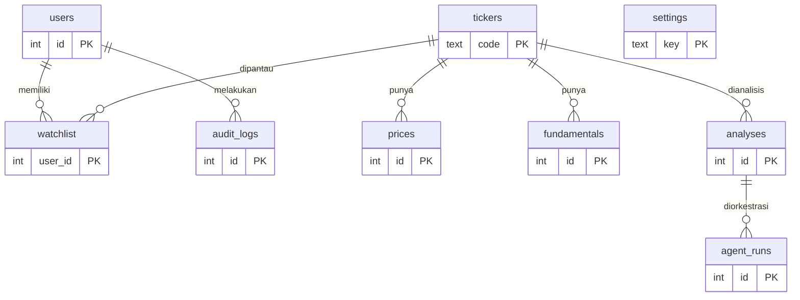

# DATAMODEL — AI Agent Analisis Saham

| | |
|---|---|
| **Dokumen** | Data Model |
| **Versi** | 1.0 |
| **Tanggal** | 26 Agustus 2026 |
| **Turunan dari** | [TRD.md](TRD.md) |
| **Terkait** | [API_CONTRACT.md](API_CONTRACT.md) · [AGENTS.md](AGENTS.md) |

---

## 1. ERD



## 2. Tabel

### 2.1 `tickers` — master emiten

| Kolom | Tipe | Aturan |
|---|---|---|
| `code` | TEXT PK | 4 huruf kapital, contoh `BBCA` |
| `name` | TEXT NOT NULL | nama emiten |
| `sector` | TEXT | sektor IDX |
| `active` | INTEGER NOT NULL DEFAULT 1 | 0 = delisting/suspend |

Mutable. Emiten delisting di-set `active = 0`, **tidak dihapus**, agar analisis lama tetap punya induk.

### 2.2 `prices` — harga harian (append-only)

| Kolom | Tipe | Aturan |
|---|---|---|
| `id` | INTEGER PK | |
| `code` | TEXT FK → tickers | |
| `trade_date` | TEXT | `YYYY-MM-DD`, tanggal bursa WIB |
| `open`,`high`,`low`,`close` | INTEGER | **rupiah penuh, integer** |
| `volume` | INTEGER | lembar |
| `source` | TEXT | identitas penyedia |
| `revision` | INTEGER DEFAULT 1 | koreksi = revision+1 |
| `fetched_at` | TEXT | UTC ISO-8601 |

`UNIQUE (code, trade_date, revision)`. Harga efektif = revision tertinggi.

> **Kenapa integer**: rupiah tidak punya sen di perdagangan saham. `float` menghasilkan selisih Rp1 acak yang muncul justru pada agregasi besar, dan angkanya tetap terlihat masuk akal sehingga tidak ada yang curiga.

### 2.3 `fundamentals` — rasio keuangan

| Kolom | Tipe | Aturan |
|---|---|---|
| `id` | INTEGER PK | |
| `code` | TEXT FK → tickers | |
| `period` | TEXT | `2026Q2` |
| `per`,`pbv`,`roe`,`der`,`net_margin` | REAL | rasio, boleh NULL |
| `source`,`fetched_at` | TEXT | |

`REAL` diizinkan di sini karena rasio memang bilangan pecahan, bukan nilai uang.

### 2.4 `analyses` — hasil analisis (append-only, immutable)

| Kolom | Tipe | Aturan |
|---|---|---|
| `id` | INTEGER PK | |
| `code` | TEXT FK → tickers | |
| `trade_date` | TEXT | tanggal bursa acuan |
| `status` | TEXT | `ok` \| `insufficient_data` \| `error` |
| `stale` | INTEGER DEFAULT 0 | 1 bila data melewati batas kesegaran |
| `score_tech`,`score_funda`,`score_total` | INTEGER | 0–100, NULL bila bukan `ok` |
| `label` | TEXT | `sangat lemah`…`sangat kuat` |
| `confidence` | TEXT | `rendah` \| `sedang` \| `tinggi` |
| `data_snapshot` | TEXT NOT NULL | **JSON: semua angka yang dipakai** |
| `narrative` | TEXT | NULL bila LLM gagal |
| `narrative_status` | TEXT | `ok` \| `fallback` \| `unavailable` \| `queued` |
| `engine_version` | TEXT NOT NULL | naik saat rumus berubah |
| `prompt_version` | TEXT | naik saat prompt berubah |
| `created_at` | TEXT NOT NULL | UTC |

**Immutable**: tidak ada `UPDATE`, tidak ada `DELETE`. Koreksi = baris baru. Inilah yang membuat laporan lama kebal terhadap perubahan harga hari ini.

#### Bentuk `data_snapshot`

```json
{
  "code": "BBCA",
  "trade_date": "2026-08-26",
  "close": 10250,
  "prev_close": 10150,
  "change_pct": 0.99,
  "window_days": 250,
  "indicators": {
    "ma20": 10120.5, "ma50": 9980.2, "ma200": 9450.1,
    "ema12": 10200.3, "ema26": 10050.7,
    "rsi14": 58.42,
    "macd": 149.6, "macd_signal": 120.4, "macd_hist": 29.2,
    "bb_upper": 10500.0, "bb_mid": 10120.5, "bb_lower": 9741.0,
    "vol_ratio": 1.34
  },
  "fundamentals": { "per": 21.4, "pbv": 4.1, "roe": 19.2, "der": 0.32, "net_margin": 31.5 },
  "weights": { "tech": 60, "funda": 40 },
  "scores": { "tech": 68, "funda": 74, "total": 70 },
  "flags": ["funda_missing"],
  "sources": { "price": "provider-a", "funda": "provider-a" },
  "engine_version": "1.0.0"
}
```

**Kontrak snapshot**: setiap angka yang muncul di UI, ekspor, atau narasi wajib ada di sini. Angka yang tidak ada di snapshot berarti analisis tidak bisa direproduksi dan narasi tidak bisa divalidasi.

### 2.5 `agent_runs` — jejak orkestrasi multi-agent (append-only)

| Kolom | Tipe | Aturan |
|---|---|---|
| `id` | INTEGER PK | |
| `analysis_id` | INTEGER FK → analyses | |
| `framework` | TEXT | `langgraph` \| `crewai` \| `langchain` \| `none` |
| `node` | TEXT | nama node/agent, mis. `fetch`, `compute`, `narrate`, `critique` |
| `status` | TEXT | `ok` \| `skipped` \| `failed` |
| `input_digest` | TEXT | SHA-256 input node |
| `output_digest` | TEXT | SHA-256 output node |
| `tokens_in`,`tokens_out` | INTEGER | 0 untuk node non-LLM |
| `duration_ms` | INTEGER | |
| `error` | TEXT | pesan singkat bila gagal |
| `created_at` | TEXT | UTC |

Menyimpan **digest**, bukan isi penuh, agar jejak orkestrasi tidak menggandakan snapshot dan tidak menyimpan prompt berisi data sensitif.

### 2.6 `users`, `watchlist`, `audit_logs`, `settings`

| Tabel | Kolom kunci | Catatan |
|---|---|---|
| `users` | `id`, `username` UNIQUE, `password_hash`, `role`, `active` | `password_hash` = `salt$hash` scrypt |
| `watchlist` | PK `(user_id, code)` | pribadi per user, disaring di server |
| `audit_logs` | `id`, `user_id`, `action`, `detail`, `created_at` | append-only |
| `settings` | `key` PK, `value` | bobot, kuota LLM, batas kesegaran |

Nilai `settings` yang dipakai v1:

| key | contoh | arti |
|---|---|---|
| `weight_tech` / `weight_funda` | `60` / `40` | wajib berjumlah 100 |
| `llm_daily_quota` | `500` | panggilan LLM per hari |
| `stale_after_days` | `1` | hari bursa sebelum ditandai basi |
| `min_window_days` | `60` | minimum hari bursa untuk analisis |

## 3. Invariant Data

| # | Invariant | Cara memeriksa |
|---|---|---|
| D-1 | Nilai uang selalu INTEGER | `PRAGMA table_info(prices)` → open/high/low/close/volume = INTEGER |
| D-2 | `prices`, `analyses`, `audit_logs`, `agent_runs` append-only | grep kode: nol `UPDATE`/`DELETE` pada tabel ini |
| D-3 | Analisis lama immutable | hitung ulang dari `data_snapshot` → skor identik |
| D-4 | Setiap `analyses.status='ok'` punya skor lengkap & snapshot valid | uji integritas per baris |
| D-5 | `weight_tech + weight_funda = 100` | validasi saat simpan setting |
| D-6 | Setiap analisis punya `engine_version` | NOT NULL |
| D-7 | Harga efektif = revision tertinggi per (code, trade_date) | query view |
| D-8 | Semua timestamp UTC, tanggal bursa WIB | `created_at` diakhiri `Z`; `trade_date` dari `trading_date()` |
| D-9 | Emiten tidak pernah dihapus, hanya `active=0` | FK dari analyses tidak pernah menggantung |

## 4. Indeks

```sql
CREATE UNIQUE INDEX ux_prices     ON prices(code, trade_date, revision);
CREATE INDEX        ix_prices_win ON prices(code, trade_date DESC);
CREATE INDEX        ix_analyses   ON analyses(code, trade_date DESC);
CREATE INDEX        ix_funda      ON fundamentals(code, period DESC);
CREATE INDEX        ix_runs       ON agent_runs(analysis_id);
CREATE INDEX        ix_audit_user ON audit_logs(user_id, created_at DESC);
```

`ix_prices_win` melayani pola akses paling panas: ambil N hari terakhir satu emiten untuk jendela indikator.

## 5. Siklus Hidup Data

| Data | Retensi | Alasan |
|---|---|---|
| `prices` | permanen | dasar reproduksi analisis lama |
| `analyses` | permanen | jejak audit, pembelajaran |
| `agent_runs` | 90 hari, lalu diringkas | jejak operasional, bukan bukti bisnis |
| `audit_logs` | permanen | kepatuhan |
| cache narasi | ikut `analyses` | tidak disimpan terpisah |

`# ponytail: agent_runs dipangkas manual lewat skrip; ganti partisi per bulan kalau > 5 juta baris.`

## 6. Migrasi

- Migrasi bernomor urut di `agent/db.py`, dijalankan otomatis saat start.
- Tabel `schema_version` menyimpan versi terakhir yang diterapkan.
- Migrasi hanya **aditif**: tambah tabel, tambah kolom nullable, tambah indeks.
- Dilarang: mengubah tipe kolom uang, menghapus kolom yang dipakai `data_snapshot` lama, mengisi ulang data historis.
- Setiap migrasi yang menyentuh rumus wajib menaikkan `engine_version`, bukan menulis ulang baris lama.

## 7. Estimasi Volume

| Skala | Baris `prices` | Baris `analyses` | Perkiraan ukuran |
|---|---|---|---|
| 100 emiten × 5 tahun | ~125.000 | ~125.000 | < 150 MB |
| 500 emiten × 5 tahun | ~625.000 | ~625.000 | < 500 MB |

SQLite sangat memadai pada skala ini. `# ponytail: satu file SQLite; pindah ke Postgres kalau > 5 juta baris prices atau butuh > 5 penulis bersamaan.`
