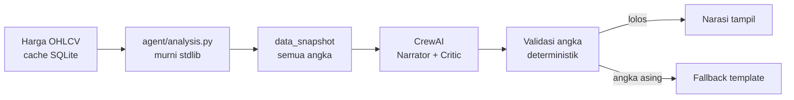

# AI Agent Analisis Saham

Agent analisis saham IDX yang memisahkan dua hal dengan tegas: **angka dihitung oleh kode, narasi ditulis oleh LLM**. Model bahasa mengarang angka dengan sangat meyakinkan, dan di domain uang kalimat yang terdengar benar tetapi angkanya salah lebih merusak daripada tidak ada kalimat sama sekali.

> Analisis ini dihasilkan otomatis untuk keperluan informasi, **bukan nasihat investasi**. Keputusan dan risikonya sepenuhnya ada pada pengguna.

## Cara Kerja



Alur diorkestrasi LangGraph: `validate → compute → narrate → critique → persist`, dengan percabangan retry saat narasi gagal validasi.

## Menjalankan

Butuh **Python 3.11–3.13**. Pada Python 3.14 sebagian dependency CrewAI (`tiktoken`) belum menyediakan wheel dan gagal dibangun tanpa Rust; sistem tetap berjalan penuh di 3.14 lewat jalur fallback, hanya tanpa narasi LLM.

```bash
pip install -r requirements.txt   # opsional, lihat Dependency di bawah
python -m agent.seed              # isi data contoh
python run_dev_server.py          # http://127.0.0.1:8000
```

Login contoh: `andi/andi123` (analyst), `owner/owner123` (admin), `tamu/tamu123` (guest).

Batch harian: `python -m agent.batch` (jadwalkan cron 17:00 WIB, setelah bursa tutup).

Konfigurasi lewat environment variable: `MARKET_API_KEY`, `LLM_API_KEY`, `SESSION_SECRET`, `STOCKS_DB`, `PORT`. Kunci API tidak pernah masuk repo maupun respons API.

## Prinsip yang Dijaga

1. **Angka dari kode, narasi dari model.** `agent/analysis.py` murni stdlib dan tidak mengimpor satu pun framework. Cabut LangChain, LangGraph, dan CrewAI hari ini, angka produk tidak berubah sedikit pun.
2. **Analisis lama tidak pernah berubah.** Setiap analisis menyimpan `data_snapshot`; harga baru hari ini tidak menggeser kesimpulan kemarin.
3. **Uang selalu integer rupiah.** Tidak ada `float` untuk nilai uang.
4. **Data kurang berarti menolak, bukan menebak.** Di bawah 60 hari bursa mengembalikan `insufficient_data`, bukan skor karangan.
5. **Tidak pernah memberi instruksi beli/jual.** Yang keluar: skor, alasan, dan tingkat keyakinan.
6. **Otorisasi diperiksa di server pada setiap endpoint.** Menyembunyikan tombol bukan otorisasi.

## Dependency

Empat paket, semuanya untuk orkestrasi, dengan justifikasi tertulis di [ADR-001](docs/adr/001-orkestrasi-multi-agent.md):

| Paket | Peran |
|---|---|
| LangChain | abstraksi provider LLM |
| LangGraph | state machine alur analisis |
| CrewAI | agent Narrator dan Critic |

Selebihnya stdlib Python: `sqlite3`, `http.server`, `hashlib`, `hmac`, `statistics`. Frontend HTML + CSS + JS vanilla tanpa build step dan tanpa CDN pihak ketiga.

**Sistem tetap berjalan penuh tanpa keempatnya** lewat `run_analysis_fallback()`, dan itu diuji, bukan sekadar diklaim.

## Verifikasi

```bash
python -m unittest discover -s tests -t .   # 112 test
python tests/verify_docs.py                 # 184 pemeriksaan dokumen
python tests/mutation_check.py              # 14 mutasi invariant
```

| Lapis | Yang dibuktikan |
|---|---|
| 112 unittest | indikator vs implementasi referensi independen, reproduksi analisis lama, anti-halusinasi, otorisasi lewat HTTP nyata |
| 184 pemeriksaan dokumen | konsistensi 8 dokumen, skema SQL dieksekusi sungguhan, endpoint kontrak vs implementasi |
| 14 mutasi | test benar-benar **gagal** saat invariant dirusak; test yang tidak pernah gagal tidak membuktikan apa pun |

Seluruh test dijalankan di dua lingkungan: dengan framework terpasang dan tanpa satu pun framework.

## Dokumentasi

| Dokumen | Isi |
|---|---|
| [BRD](BRD.md) | kebutuhan bisnis, tujuan terukur, risiko |
| [PRD](PRD.md) | spesifikasi produk, peran, fitur v1 |
| [FRD](FRD.md) | kebutuhan fungsional ber-ID |
| [TRD](TRD.md) | arsitektur, skema, keamanan |
| [USERFLOW](USERFLOW.md) | alur pengguna dan jalur kegagalan |
| [DATAMODEL](DATAMODEL.md) | ERD, tabel, invariant data |
| [API_CONTRACT](API_CONTRACT.md) | endpoint, error, otorisasi |
| [AGENTS](AGENTS.md) | aturan teknis yang mengikat kontributor |

## Status

v1, cakupan IDX dengan analisis harian. Belum termasuk: eksekusi order, data intraday realtime, backtesting otomatis. Lima asumsi terbuka menunggu keputusan di [PRD §9](PRD.md).
