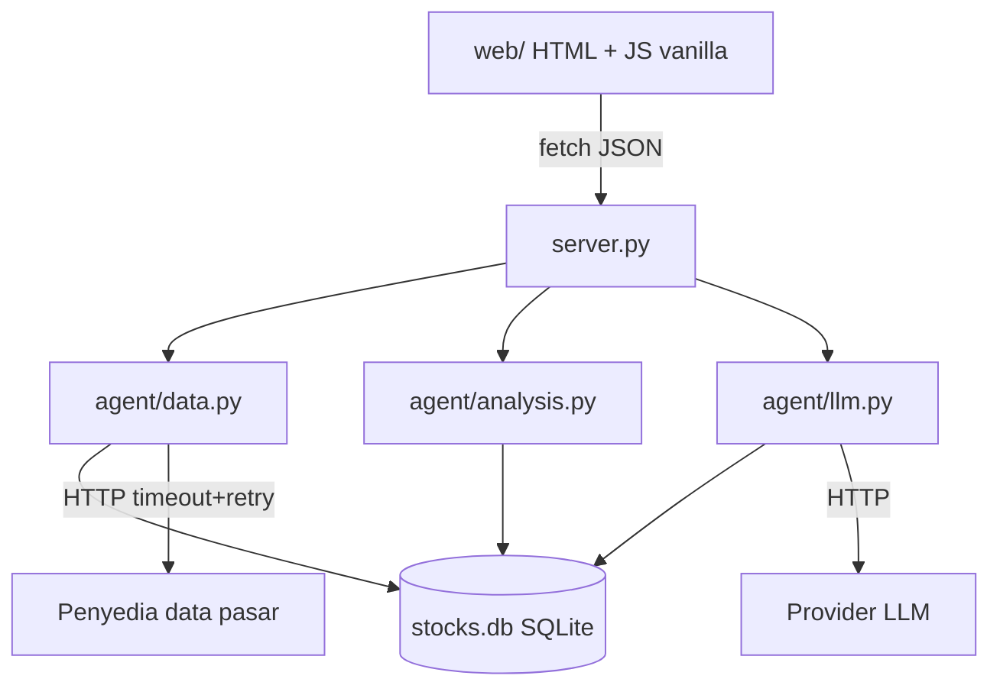

# TRD — AI Agent Analisis Saham

| | |
|---|---|
| **Dokumen** | Technical Requirements Document |
| **Versi** | 1.0 |
| **Tanggal** | 26 Agustus 2026 |
| **Turunan dari** | [FRD.md](FRD.md) |
| **Aturan mengikat** | [AGENTS.md](AGENTS.md) |

---

## 1. Arsitektur



Proses tunggal, satu file database, tanpa message broker. Batch dijalankan sebagai perintah CLI (`python -m agent.batch`) yang dipicu cron.

## 2. Stack & Batasan

| Bagian | Teknologi | Catatan |
|---|---|---|
| Bahasa | Python ≥ 3.11 | type hints wajib pada fungsi publik |
| Web server | `http.server`/`wsgiref` stdlib | `fastapi` hanya bila API publik disetujui |
| DB | `sqlite3` stdlib, mode WAL | `PRAGMA journal_mode=WAL; foreign_keys=ON` |
| HTTP client | `urllib.request` | timeout wajib, tanpa `requests` |
| Hashing | `hashlib.scrypt` | tanpa bcrypt/argon2 |
| Sesi | cookie HMAC via `hmac`+`secrets` | `HttpOnly`, `SameSite=Lax`, `Secure` di produksi |
| Frontend | HTML + CSS + JS vanilla | tanpa build step, tanpa CDN pihak ketiga |
| Grafik | `<canvas>` 2D | tanpa chart library |
| Test | `unittest` stdlib | `python -m unittest discover -s tests` |

Penambahan dependency wajib disertai alasan tertulis di commit.

## 3. Skema Data

```sql
CREATE TABLE tickers (
  code        TEXT PRIMARY KEY,          -- 4 huruf kapital
  name        TEXT NOT NULL,
  sector      TEXT,
  active      INTEGER NOT NULL DEFAULT 1
);

-- append-only
CREATE TABLE prices (
  id          INTEGER PRIMARY KEY,
  code        TEXT NOT NULL REFERENCES tickers(code),
  trade_date  TEXT NOT NULL,             -- YYYY-MM-DD, tanggal bursa WIB
  open        INTEGER NOT NULL,          -- rupiah penuh, integer
  high        INTEGER NOT NULL,
  low         INTEGER NOT NULL,
  close       INTEGER NOT NULL,
  volume      INTEGER NOT NULL,
  source      TEXT NOT NULL,
  revision    INTEGER NOT NULL DEFAULT 1,
  fetched_at  TEXT NOT NULL              -- UTC ISO-8601
);
CREATE UNIQUE INDEX ux_prices ON prices(code, trade_date, revision);

CREATE TABLE fundamentals (
  id          INTEGER PRIMARY KEY,
  code        TEXT NOT NULL REFERENCES tickers(code),
  period      TEXT NOT NULL,             -- 2026Q2
  per         REAL, pbv REAL, roe REAL, der REAL, net_margin REAL,
  source      TEXT NOT NULL,
  fetched_at  TEXT NOT NULL
);

-- append-only, immutable
CREATE TABLE analyses (
  id             INTEGER PRIMARY KEY,
  code           TEXT NOT NULL REFERENCES tickers(code),
  trade_date     TEXT NOT NULL,
  status         TEXT NOT NULL,          -- ok | insufficient_data | error
  score_tech     INTEGER,                -- 0..100
  score_funda    INTEGER,
  score_total    INTEGER,
  label          TEXT,
  confidence     TEXT,                   -- rendah | sedang | tinggi
  data_snapshot  TEXT NOT NULL,          -- JSON: semua angka yang dipakai
  narrative      TEXT,
  engine_version TEXT NOT NULL,
  prompt_version TEXT,
  created_at     TEXT NOT NULL           -- UTC
);
CREATE INDEX ix_analyses ON analyses(code, trade_date);

CREATE TABLE users (
  id            INTEGER PRIMARY KEY,
  username      TEXT UNIQUE NOT NULL,
  password_hash TEXT NOT NULL,           -- scrypt: salt$hash
  role          TEXT NOT NULL,           -- guest | analyst | admin
  active        INTEGER NOT NULL DEFAULT 1
);

CREATE TABLE watchlist (
  user_id INTEGER NOT NULL REFERENCES users(id),
  code    TEXT NOT NULL REFERENCES tickers(code),
  PRIMARY KEY (user_id, code)
);

-- append-only
CREATE TABLE audit_logs (
  id         INTEGER PRIMARY KEY,
  user_id    INTEGER,
  action     TEXT NOT NULL,
  detail     TEXT,
  created_at TEXT NOT NULL
);

CREATE TABLE settings (
  key   TEXT PRIMARY KEY,
  value TEXT NOT NULL                    -- bobot skoring, kuota LLM, dll
);
```

**Invariant DB**: `prices`, `analyses`, `audit_logs` tidak pernah di-`UPDATE`/`DELETE`. Harga adalah integer rupiah. Semua timestamp UTC.

## 4. Modul

| File | Tanggung jawab | Batas |
|---|---|---|
| `agent/db.py` | koneksi, migrasi, helper query | tidak memuat logika bisnis |
| `agent/data.py` | fetch + cache + validasi kelengkapan | satu-satunya yang bicara ke penyedia data |
| `agent/analysis.py` | indikator, skoring, snapshot | murni & deterministik, tanpa I/O jaringan |
| `agent/llm.py` | prompt, panggilan LLM, validasi anti-halusinasi | tidak pernah menghitung angka |
| `agent/batch.py` | runner watchlist + kuota | CLI |
| `server.py` | routing, auth, otorisasi, render | tipis |
| `web/*` | UI | tanpa logika finansial |

## 5. Kontrak API

| Method | Path | Peran | Keterangan |
|---|---|---|---|
| POST | `/api/login` | publik | body `{username, password}` |
| POST | `/api/logout` | terautentikasi | |
| GET | `/api/tickers?q=` | guest+ | pencarian emiten |
| GET | `/api/prices/:code?from=&to=` | guest+ | OHLCV dari cache |
| POST | `/api/analyze/:code` | analyst+ | jalankan analisis |
| GET | `/api/analyses/:code` | guest+ | riwayat |
| GET | `/api/analyses/id/:id` | guest+ | snapshot spesifik |
| GET/POST/DELETE | `/api/watchlist` | analyst+ | milik sendiri |
| POST | `/api/batch` | admin | jalankan batch |
| GET/PUT | `/api/settings` | admin | bobot, kuota |
| GET | `/api/export/:code.csv` | analyst+ | ekspor + disclaimer |

Respons error seragam: `{"error": {"code": "...", "message": "..."}}` dengan HTTP status tepat. Tidak pernah membocorkan stack trace ke klien.

## 6. Algoritma Inti

- **RSI(14)**: metode Wilder smoothing, bukan SMA sederhana.
- **EMA(n)**: `alpha = 2/(n+1)`, seed = SMA n periode pertama.
- **MACD**: `EMA12 - EMA26`, signal `EMA9(MACD)`, histogram = MACD - signal.
- **Bollinger(20,2)**: SMA20 ± 2 × stdev populasi 20.
- **Skor teknikal**: jumlah tertimbang sinyal ternormalisasi ke 0–100, bobot dari `settings` (total wajib 100).
- **Skor komposit**: `round(w_t*score_tech + w_f*score_funda)`; bila fundamental absen, komposit = teknikal dan ditandai `funda_missing`.
- **Tingkat keyakinan**: fungsi dari kelengkapan data, likuiditas (volume rata-rata), dan konsistensi antar sinyal.

Semua fungsi di `analysis.py` murni: menerima list harga, mengembalikan dict. Tidak menyentuh DB atau jaringan.

## 7. Integrasi Eksternal

- **Penyedia harga**: timeout 10 detik, retry maks 3 dengan backoff 1s/2s/4s, respons di-cache per (code, trade_date). Kegagalan total → layani dari cache dengan penanda `stale`.
- **Provider LLM**: timeout 30 detik, retry 1, suhu rendah, keluaran JSON terstruktur. Kuota harian dari `settings`. Kegagalan → analisis tetap tersimpan tanpa narasi.
- **Validasi anti-halusinasi**: ekstrak semua token numerik dari narasi, cocokkan dengan nilai di `data_snapshot` (toleransi pembulatan tampilan). Ada angka asing → ulang sekali → fallback narasi template.

## 8. Keamanan

1. Kunci API hanya dari environment variable (`MARKET_API_KEY`, `LLM_API_KEY`, `SESSION_SECRET`). Tidak pernah di-commit, tidak pernah dikirim ke frontend.
2. Password: `hashlib.scrypt` dengan salt acak per user.
3. Sesi: cookie ditandatangani HMAC-SHA256, `HttpOnly`, `SameSite=Lax`, umur terbatas.
4. Semua query memakai parameter binding; tidak ada string SQL yang dirakit.
5. Otorisasi diperiksa server-side pada setiap endpoint, berbasis peran.
6. Rate limit sederhana per IP pada `/api/login` dan `/api/analyze`.
7. Output HTML di-escape; tidak ada `innerHTML` untuk data dari server.

## 9. Kinerja

| Aspek | Target | Cara |
|---|---|---|
| Analisis cache hangat | < 2 detik | indikator dihitung in-memory dari SQLite |
| Analisis cache dingin | < 15 detik | satu panggilan data + satu panggilan LLM |
| Batch 100 emiten | < 15 menit | pemrosesan berurutan, narasi di-cache |
| Ukuran DB | < 500 MB pada 500 emiten × 5 tahun | integer, tanpa duplikasi |

`# ponytail: indikator dihitung ulang tiap request; ganti tabel indikator terprakomputasi kalau watchlist > 500 emiten.`

## 10. Pengujian

Tiga invariant wajib di `tests/`:

1. **`test_indicators.py`** — RSI/EMA/MACD terhadap dataset referensi, selisih ≤ 0,01.
2. **`test_reproducibility.py`** — analisis lama direproduksi dari `data_snapshot` menghasilkan skor identik; perubahan harga hari ini tidak mengubah hasil lama.
3. **`test_guards.py`** — data kurang dari 60 hari → `insufficient_data`; narasi dengan angka asing ditolak; endpoint menolak peran tidak berhak.

Perintah: `python -m unittest discover -s tests`. Merah = bug produk, bukan test yang dilonggarkan.

## 11. Deployment & Operasi

- Satu proses Python, satu file `stocks.db`, dijalankan di balik reverse proxy TLS.
- Konfigurasi lewat environment variable; tidak ada file rahasia di repo.
- Backup: salin `stocks.db` harian setelah batch (`VACUUM INTO`).
- Log terstruktur ke stdout; audit bisnis ke tabel `audit_logs`.
- Cron: batch pukul 17:00 WIB (setelah bursa tutup 16:00).

## 12. Kriteria Penerimaan Teknis

- [ ] `python -m unittest discover -s tests` hijau.
- [ ] Tidak ada dependency di luar stdlib tanpa alasan tertulis.
- [ ] Tidak ada `float` untuk nilai uang.
- [ ] Tidak ada `UPDATE`/`DELETE` pada tabel append-only.
- [ ] Semua endpoint memeriksa otorisasi server-side.
- [ ] Tidak ada kunci API di repo maupun di respons API.
- [ ] Target kinerja NF-1..NF-3 terpenuhi pada dataset uji.
