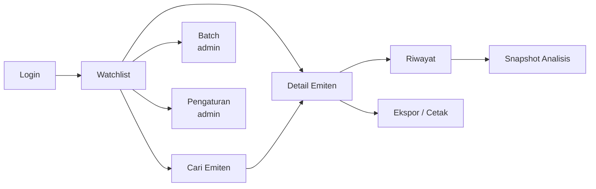
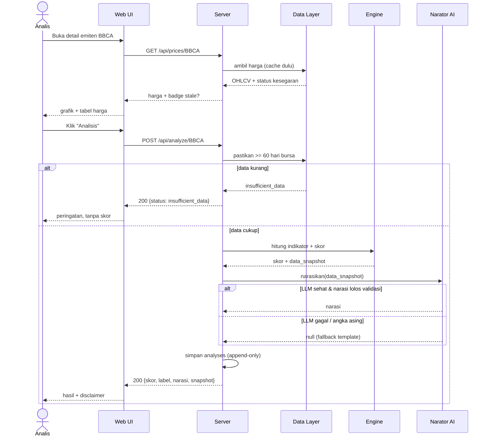
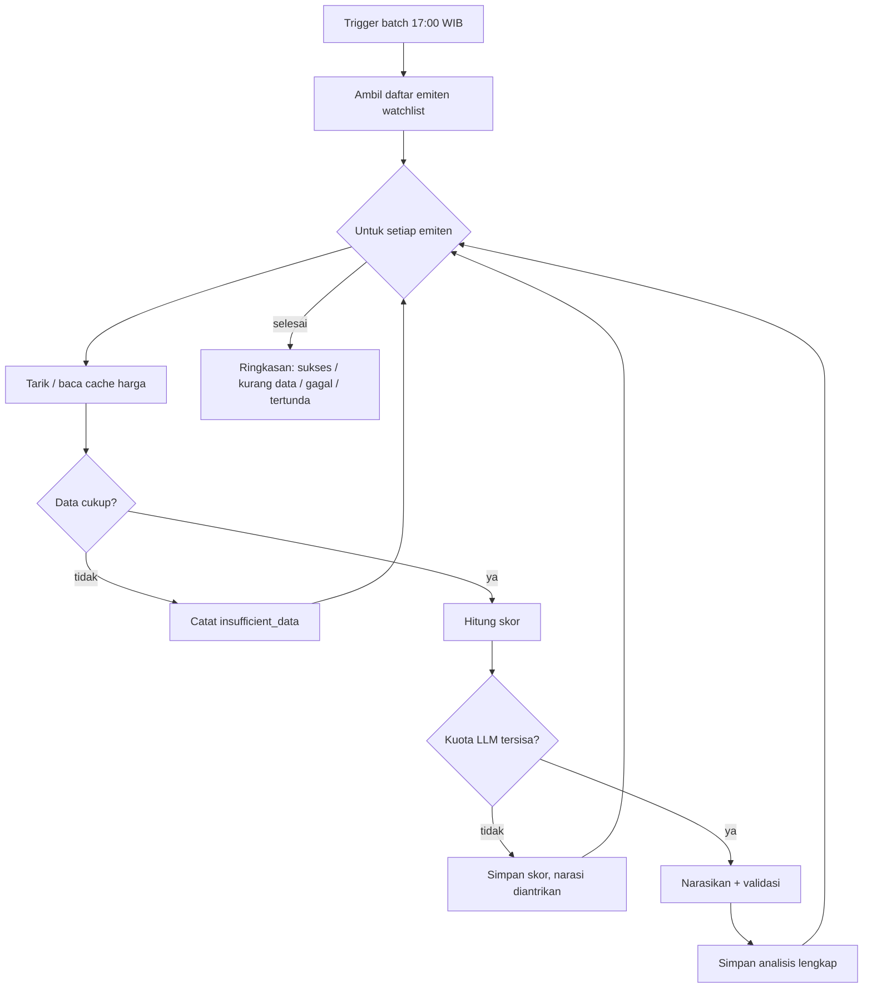

# USERFLOW — AI Agent Analisis Saham

| | |
|---|---|
| **Dokumen** | User Flow |
| **Versi** | 1.0 |
| **Tanggal** | 26 Agustus 2026 |
| **Turunan dari** | [PRD.md](PRD.md) · [FRD.md](FRD.md) |
| **Diteruskan ke** | [API_CONTRACT.md](API_CONTRACT.md) |

---

## 1. Peta Navigasi

Empat halaman inti: **Watchlist** (beranda), **Detail Emiten**, **Riwayat**, **Pengaturan**. Tidak ada menu bertingkat. Analis harus bisa dari login ke hasil analisis dalam dua klik.

## 2. Alur Utama

### UF-1 — Analisis satu emiten (alur emas)

**Aktor**: analyst · **Prasyarat**: sudah login · **Target**: < 2 menit (NF-1)

**Langkah pengguna**
1. Analis membuka Watchlist, mengklik satu emiten.
2. Halaman detail menampilkan grafik harga + MA, tabel indikator terakhir, dan status kesegaran data.
3. Analis menekan **Analisis**. Tombol dinonaktifkan selama proses, dengan indikator progres.
4. Hasil muncul: skor komposit, label kualitatif, tingkat keyakinan, faktor risiko, narasi AI, disclaimer.
5. Analis dapat langsung menekan **Ekspor CSV** atau **Cetak PDF**.

**Jalur alternatif**
- **A1 — Data kurang dari 60 hari bursa**: tampilkan panel `insufficient_data` berisi jumlah hari yang tersedia dan yang dibutuhkan. Tidak ada skor. Tombol Analisis tetap aktif untuk dicoba lagi besok.
- **A2 — Data basi**: badge kuning `stale` + tanggal data terakhir. Analisis tetap boleh jalan, hasilnya ditandai basi.
- **A3 — Penyedia data mati**: layani dari cache dengan badge `stale`, tampilkan pesan netral. Bukan halaman error.
- **A4 — LLM gagal atau kuota habis**: skor tetap tampil penuh; blok narasi diganti pesan "narasi tidak tersedia" + alasan singkat. Analisis tetap tersimpan.
- **A5 — Narasi gagal validasi angka**: sistem mengulang sekali, lalu jatuh ke ringkasan template. Pengguna tidak pernah melihat narasi yang gagal validasi.

### UF-2 — Kelola watchlist

**Aktor**: analyst

1. Di halaman Watchlist, analis mengetik kode/nama di kotak cari.
2. Sistem menampilkan saran emiten aktif (maks 10).
3. Analis memilih satu → emiten masuk watchlist miliknya.
4. Baris baru muncul dengan harga terakhir dari cache dan skor terakhir bila ada.
5. Menghapus emiten butuh konfirmasi satu langkah, dan tidak menghapus riwayat analisisnya.

**Aturan**: watchlist bersifat pribadi per user, disaring di server. Analis tidak pernah melihat watchlist orang lain.

### UF-3 — Batch harian

**Aktor**: admin (atau cron) · **Waktu**: 17:00 WIB, setelah bursa tutup

Batch tidak pernah berhenti total karena satu emiten gagal. Setiap kegagalan dicatat per emiten dan dilaporkan di ringkasan akhir.

### UF-4 — Riwayat & reproduksi

**Aktor**: analyst, admin, guest (baca)

1. Dari detail emiten, analis membuka tab **Riwayat**.
2. Daftar analisis kronologis: tanggal, skor, label, versi engine, versi prompt.
3. Mengklik satu baris membuka **snapshot**: seluruh angka persis seperti saat itu.
4. Halaman snapshot memberi tanda jelas bahwa ini arsip, bukan analisis terkini, beserta tanggal datanya.

**Invariant terlihat oleh pengguna**: membuka analisis 90 hari lalu hari ini menghasilkan angka yang identik dengan 90 hari lalu.

### UF-5 — Pengaturan (admin)

1. Admin membuka Pengaturan.
2. Mengubah bobot teknikal/fundamental. Form menolak simpan bila total ≠ 100, dengan pesan yang menyebut total saat ini.
3. Mengubah kuota LLM harian dan batas kesegaran data.
4. Menyimpan menaikkan `engine_version` bila bobot berubah, dan menulis satu baris audit.
5. Kunci API **tidak pernah** ditampilkan, bahkan tersamar. Hanya status "terpasang / belum terpasang".

### UF-6 — Login & sesi

1. Pengguna membuka aplikasi. Bila belum ada sesi valid → halaman login.
2. Salah kredensial → pesan generik "username atau password salah" (tidak membocorkan mana yang salah), dengan rate limit per IP.
3. Berhasil → cookie sesi `HttpOnly` diset, diarahkan ke Watchlist.
4. Sesi kedaluwarsa saat aksi → diarahkan ke login dengan pesan, tanpa kehilangan konteks halaman.

## 3. Alur per Peran

| Langkah | guest | analyst | admin |
|---|:---:|:---:|:---:|
| Lihat harga & analisis publik | ✅ | ✅ | ✅ |
| Jalankan analisis on-demand | ❌ | ✅ | ✅ |
| Kelola watchlist sendiri | ❌ | ✅ | ✅ |
| Jalankan batch watchlist | ❌ | ❌ | ✅ |
| Ekspor CSV / cetak PDF | ❌ | ✅ | ✅ |
| Ubah bobot skoring | ❌ | ❌ | ✅ |
| Kelola sumber data & kunci API | ❌ | ❌ | ✅ |
| Kelola user | ❌ | ❌ | ✅ |
| Lihat audit log | ❌ | miliknya | semua |

Guest melihat tombol yang tidak berhak dalam keadaan nonaktif disertai alasan, bukan disembunyikan diam-diam. Otorisasi tetap diperiksa di server.

## 4. Status yang Dilihat Pengguna

| Status | Tampilan | Yang bisa dilakukan pengguna |
|---|---|---|
| `ok` | skor + narasi + disclaimer | ekspor, cetak, buka riwayat |
| `insufficient_data` | panel abu, jumlah hari tersedia vs dibutuhkan | coba lagi nanti, pilih emiten lain |
| `stale` | badge kuning + tanggal data | tetap analisis, sadar datanya basi |
| `error` | pesan netral, tanpa stack trace | coba lagi, hubungi admin |
| `narasi tidak tersedia` | skor tetap tampil, blok narasi diganti pesan | tetap pakai skor, minta ulang nanti |

## 5. Prinsip Interaksi

- **Dua klik ke hasil.** Login → Watchlist → Detail. Tidak ada wizard, tidak ada langkah konfirmasi yang tidak menyelamatkan data.
- **Tidak pernah menyembunyikan ketidakpastian.** `stale` dan `insufficient_data` selalu terlihat.
- **Disclaimer permanen** di setiap halaman analisis dan setiap ekspor.
- **Bahasa non-direktif.** Tidak ada tombol atau label "Beli"/"Jual".
- **Kegagalan selalu bisa ditindaklanjuti.** Tidak ada spinner selamanya, tidak ada pesan teknis mentah.
- **Aksesibilitas**: seluruh alur di atas dapat diselesaikan dengan keyboard saja; grafik punya padanan tabel angka.
